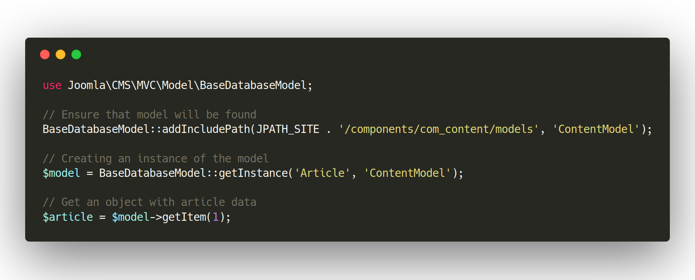
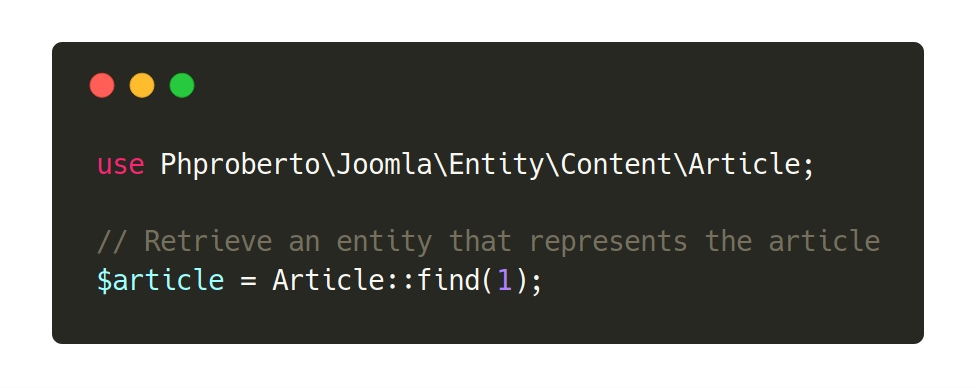

# Entity system for Joomla!

> Because developing Joomla extensions should be fun and easy.

## Quickstart <a id="quickstart"></a>

Let's use a fast example. This is how you actually can load an article by its id in Joomla:



Where `$article` is a `stdClass` object. You can access its properties but it's really a dummy thing. An end point.

With an Article entity you can do:



Here `$article` is an Article entity. An object that exposes its logic and resources to the developer.

Some awesome things that you can do with that article entity:

```php
// Use article as entity
echo $article->get('title');

// Use params transparently
if ($article->param('show_title', '1') === '1')
{
	echo $article->get('title');
}

// Check if article is featured
if ($article->isFeatured())
{
	// Do something
}

// Check if article has an intro image
if ($article->hasIntroImage())
{
	$image = $article->getIntroImage();
	echo '';
}

// Check article state
if ($article->isPublished())
{
	echo 'Article published!';
}

// Retrieve article category
echo $article->category()->get('title');

// You can modify article properties
$article->set('title', 'My modified title');

// And save it
try	
{
	$article->save();
}
catch (\RuntimeException $e)
{
	echo 'There was an error saving article: ' . $e->getMessage();
}
```

See the [full documentation](https://phproberto.github.io/joomla-entity) for other examples.

## Installation <a id="installation"></a>

Go to the [releases section](https://github.com/phproberto/joomla-entity/releases) and follow the `How to install / upgrade` instructions in the latest release.

## Documentation <a id="documentation"></a>

Documentation is published in [https://phproberto.github.io/joomla-entity/](https://phproberto.github.io/joomla-entity).

## Requirements <a id="requirements"></a>

* **PHP 5.5+** 
* **Joomla! CMS v3.7+**

## Copyright & License <a id="license"></a>

This library is licensed under [GNU LESSER GENERAL PUBLIC LICENSE](./LICENSE).  

Copyright (C) 2017-2018 [Roberto Segura López](http://phproberto.com) - All rights reserved.  
